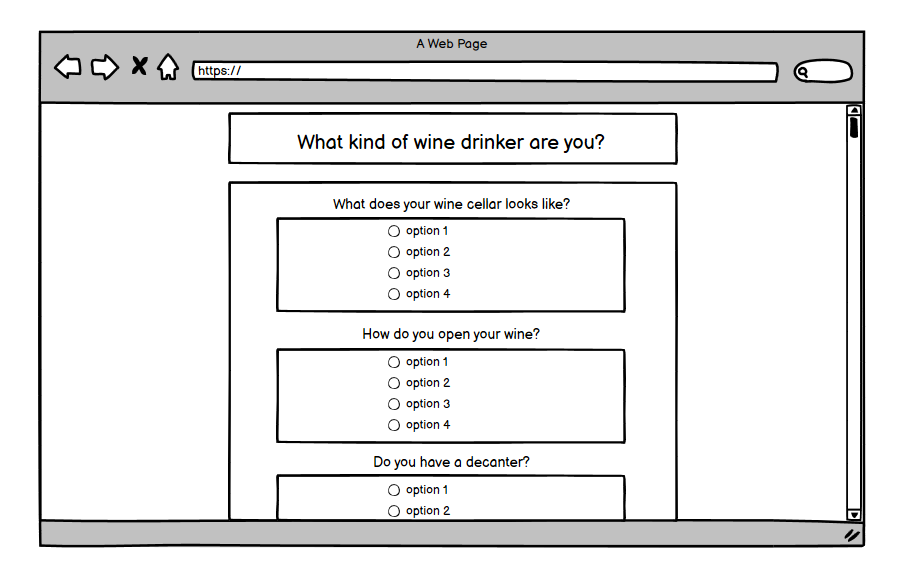

# WINE PERSONALITY TEST

[View the live project here.](https://marianneuk.github.io/Wine-Questionnaire/)

Ever wonder how you stand up to other wine drinkers? Take this simple 6 question quiz to find out!

# Table of Contents
- [1. User Experience (UX) development process](#ux)
  * [1.1. Strategy](#strategy)
    + [Project Goals](#project-goals)
    + [User Goals](#user-goals)
    + [User Expectations](#user-expectations)
  * [1.2. Structure](#structure)
  * [1.3. Skeleton](#skeleton)
  * [1.4. Surface](#surface)
- [2. Features](#features)
- [3. Technologies Used](#technologies-used)
- [4. Testing](#testing)
- [5. Known Bugs](#known-bugs)
- [6. Deployment](#deployment)
- [7. End Product](#end-product)
- [8. Credits](#credits)

# 1. User Experience (UX) development process
  [Go to the top](#table-of-contents)

According to [Jesse James Garrett](http://www.jjg.net/elements/pdf/elements_ch02.pdf), the user experience development process is all about ensuring that no aspect of the user’s experience with your site happens without your conscious, explicit intent. This means taking into account every possibility of every action the user is likely to take and understanding the user’s expectations at every step of the way through that process.

## 1.1. Strategy
  [Go to the top](#table-of-contents)

Jesse James Garrett also explains that strategy incorporates not only what the people running the site want to get out of it but what the users want to get out of the site as well.

### Project Goals

The main goals of this website is for users to discover what kind of wine drinker they may be. A personality test was chosen rather than a Q&amp;A quiz, so clever users could not find the answers via their browser's developer tool.

### User Goals
 * First Time User Goals
    - First time users will want to know which type of wine drinker they are.
    - First time users will want to have fun.

 *  Returning User Goals
    - Returning users will want to compare various answers to discover the different types of wine drinker.
    - Returning users will want to have fun.

 *  Frequent User Goals
    - Frequent user will want to test their friends.
    - Frequent users will want to have fun.

### User Expectations
According to [Jennifer V. Fayard Ph.D.](https://www.psychologytoday.com/gb/blog/people-are-strange/201909/why-do-we-personality-tests-even-the-bad-ones), one of the reasons people like to take personality tests in the first place is that they want to learn about ourselves.

## 1.2. Structure
  [Go to the top](#table-of-contents)

The project must have a responsive design as many users are using different devices (mobile, tablet, laptop/desktop). This gives the user the best experience on their device.

 - Responsive on all devices sizes
 - All elements are consistent including font size, font family, colour scheme.

## 1.3. Skeleton
  [Go to the top](#table-of-contents)

According to [WebFX](https://www.webfx.com/blog/web-design/wireframing-benefits/), wireframes give web developers a clear path of what has to be done. It clarifies the direction and objectives of the site build and allows for better decision-making as to which web technologies, techniques and processes should be used in order to achieve an excellent result.

For this project, wireframes were created using [Balsamiq](https://balsamiq.com/)

### Wireframes    

Home Page Web Wireframe:

  

Result Page Web Wireframe:

  

Home Page Mobile Wireframe:

  

Result Page Mobile Wireframe:

        

## 1.4. Surface
  [Go to the top](#table-of-contents)

### Colours
The main colours for this project are a light shade of brown (#F1D8BC) and Gray44 (#707070).

### Typography
The font used throughout the project is Montserrat, whilst the headers (h1 and h2) are in Varela Round, with Sans Serif as the fallback font in case for any reason the font isn't being imported into the site correctly.

### Imagery
The background image was found on the website [Unsplash](https://unsplash.com/s/photos/wine-corks) and published by Elisha Terada.

# 2. Features
  [Go to the top](#table-of-contents)

### Existing Features

- __The landing page__

  - The landing page provides the users with all the questions. Upon answering all questions and clicking the Submit button, the result(s) will be shown.

- __Quiz questions__

  - The questions are shown from top to bottom, one after the other.

- __Buttons__ 

  - Two buttons provide the user with two possible options, reset or submit.

- __Quiz result__ 

  - A separate container is visible at the bottom of the page. After submitting, one or two results may show, depending on the user's responses.

- __Footer__ 

  - The footer gives credit to the authors of the test.

### Features Left to Implement

- Questions could appear in separate containers as opposed to one after the other.

# 3. Technologies Used
  [Go to the top](#table-of-contents)

* [Balsamiq](https://balsamiq.com/) for wireframes design.
* [Gitpod](https://www.gitpod.io/) for writing of the code as well as the readme file.
* [HTML5](https://en.wikipedia.org/wiki/HTML5) as this project uses HyperText Markup Language.
* [CSS3](https://en.wikipedia.org/wiki/Cascading_Style_Sheets) as this project uses Cascading Style Sheets.
* [JavaScript](https://www.javascript.com/) as this project uses Javascript for functionality.
* [Google Chrome DevTool](https://www.google.com/intl/en_uk/chrome/) for debugging.
* [GitHub](https://github.com/) for deployment.

# 4. Testing
  [Go to the top](#table-of-contents) 

## Manual Testing

The site has been tested on various browsers such as Google Chrome, Safari and Mozilla Firefox, on multiple devices such as desktop, laptop, tablet and mobile.

Below is the testing process for the quiz on desktop and mobile versions:

### Main page:

- Questions 
    - All radio buttons are working.

- Submit quiz 
    - When clicking the submit button, results appear or the "unclear result" message. 

- Reset quiz 
    - The reset button reloads the page and reset the test.

- Results 
    - Result appear in the container. A message will appear if the result is unclear.

- Text:
    - All text is in the correct and consistent size, font and color. Text has also been checked for typos.

- Media:
    - The background image loads on the page. The image has alt text equivalent in a contrasted color if not loading or for visually impaired users. Working as expected.

- Responsiveness:
    - The site is fully responsive.

## Automated testing

### W3C Validator Tools

The W3C Markup Validator and W3C CSS Validator Services were used to validate every page of the project to ensure there were no syntax errors in the project.

- [Markup Validation Service](https://validator.w3.org/)
  - No Error Found.
- [W3C CSS Validator](https://jigsaw.w3.org/css-validator/validator.html.en)
  - No Error Found.

# 5. Known Bugs
  [Go to the top](#table-of-contents)

- I could not manage to add margin above the title, as the background image was moving down with the title.
- Whilst testing on my mobile phone, I noticed the background image was not reaching the bottom of the screen.

# 6. Deployment
  [Go to the top](#table-of-contents)

GitHub pages was used to deploy the final project. 
Below is the step by step process for deployment:

  1. Log in to GitHub and locate the [GitHub Repository](https://github.com/)
  2. At the top of the Repository (not top of page), locate the "Settings" Button on the menu.
  3. Scroll down the Settings page until you locate the "GitHub Pages" Section.
  4. Under "Source", click the dropdown called "None" and select "Master Branch".
  5. The page will automatically refresh.
  6. Scroll back down through the page to locate the now published site [link](https://github.com) in the "GitHub Pages" section.

# 7. End Product
  [Go to the top](#table-of-contents)

Below are screenshots of the end product, for desktop and mobile:

Home page desktop:
  

Home page mobile:
  

# 8. Credits
  [Go to the top](#table-of-contents)

### Design

- Designed by Marianne Johany.

### Code

- [MDN Web Docs](https://developer.mozilla.org/): for refreshers on standard practices.
- [W3Schools](https://www.w3schools.com/): for more refreshers on standard practices.

### Content 

- All content was written by [Madeline Puckette](https://winefolly.com/lifestyle/types-of-wine-drinkers/)
- The icons in the footer were taken from [Font Awesome](https://fontawesome.com/)

### Media

- The background image was provided by Elisha Teradavia the website [Unsplash](https://unsplash.com/s/photos/wine-corks).

### Acknowledgements

- Thank you to the Code Institute for their support.